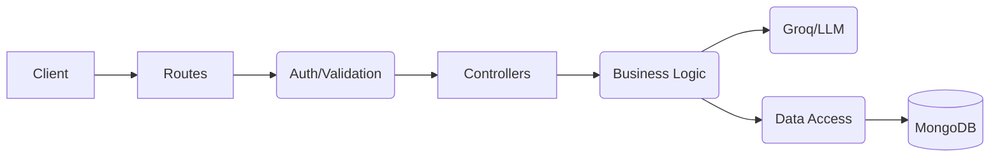

<div align="center">

# ShopSphere
### Production-Oriented Full Stack E-Commerce System

[]()
[]()
[]()
[]()
[]()
[]()

**Engineered with scalable architecture, backend rigor, and system design principles.**

### 🌐 Live Demo: [ShopSphere Production](https://ecommerce-frontend-5yug.onrender.com)

</div>

---

## 📖 Table of Contents
- [Project Overview](#-project-overview)
- [System Architecture](#-system-architecture)
- [Core Features](#-core-features)
- [Tech Stack](#-tech-stack)
- [Project Structure](#-project-structure)
- [Getting Started](#-getting-started)
- [Design Principles](#-design-principles)
- [AI Integration](#-ai-integration)
- [Database Modeling](#-database-modeling)

---

## 🌟 Project Overview

**ShopSphere** is a premium, full-stack E-Commerce platform designed with a "Dark Luxury" aesthetic. While delivering a seamless shopping experience, the project's primary objective is to demonstrate **advanced backend engineering** and **clean system design**.

Key highlights include:
- **Layered Architecture**: Strict separation of concerns (Controller → Service → Repository).
- **AI-Powered Discovery**: Integration with Groq (Llama 3) for natural language product matching.
- **Robust Security**: JWT-based authentication with role-based access control (RBAC).
- **Scalable Design**: Optimized MongoDB relationships and repository-patterned data access.

---

## 🏗 System Architecture

The application follows a highly modular, layered architecture to ensure maintainability and testability.

### Backend Flow


### OOP & Design Patterns
- **Repository Pattern**: Abstracting persistence logic from business services.
- **Service Layer Pattern**: Centralizing core business rules.
- **Strategy Pattern**: Flexible payment processing handling different providers.
- **Singleton**: Optimized database connection management.
- **Encapsulation**: Strict scoping of module logic and data models.

---

## 🚀 Core Features

### 👤 User Capabilities
- **Authentication**: Secure registration and login using JWT and Bcrypt.
- **Interactive Browsing**: Filter products by category and explore the luxury catalog.
- **Persistent Cart**: Items remain in the user's cart across sessions.
- **Order Flow**: Integrated checkout process with order history and tracking.
- **AI Concierge**: Find products using natural language queries (e.g., "Show me something elegant for a formal dinner").

### 🛠 Admin Dashboard
- **Inventory Management**: Full CRUD operations for products and categories.
- **Order Oversight**: Monitor all customer orders and update shipping statuses.
- **Database Control**: Ability to seed and reset system data.

---

## 💻 Tech Stack

| Layer | Technologies |
| :--- | :--- |
| **Frontend** | React (Vite), TypeScript, Tailwind CSS, Framer Motion, Lucide Icons |
| **Backend** | Node.js, Express, TypeScript, Mongoose |
| **Database** | MongoDB Atlas |
| **AI** | Groq SDK (Llama 3 70B) |
| **Auth** | JSON Web Tokens (JWT), Bcrypt.js |
| **Dev Tools** | Concurrenty, ESLint, TypeScript |

---

## 📁 Project Structure

```bash
root/
├── backend/            # Express Server (TypeScript)
│   ├── src/
│   │   ├── modules/    # AI, Auth, Cart, Order, Payment, Product, User
│   │   ├── middleware/ # Auth guards, Error handling
│   │   ├── config/     # DB & SDK configurations
│   │   ├── seeders/    # Data initialization scripts
│   │   └── utils/      # Shared helpers (ApiResponse, ApiError)
├── frontend/           # React Application (TypeScript)
│   ├── src/
│   │   ├── components/ # Reusable UI elements
│   │   ├── pages/      # View components (Home, Discovery, Cart)
│   │   ├── store/      # Global state management
│   │   └── styles/     # Global CSS and Tailwind configs
├── diagrams/           # ER, Class, Sequence & Use Case documents
├── idea.md             # Original project vision
└── product_data.csv    # Seed data for 500+ items
```

---

## 🚦 Getting Started

### Prerequisites
- Node.js (v18+)
- MongoDB connection string
- Groq API Key (for discovery features)

### Installation
1. Clone the repository
2. Install dependencies in the root folder:
   ```bash
   npm install
   ```

### Configuration
Create a `.env` file in the `backend/` directory:
```env
PORT=5000
MONGO_URI=your_mongodb_uri
JWT_SECRET=your_secure_secret
GROQ_API_KEY=your_groq_api_key
```

### Development
Run both frontend and backend concurrently:
```bash
npm run dev
```

### Data Seeding
Initialize the database with the luxury product catalog:
```bash
npm run seed
```

---

## 🧠 AI Integration

ShopSphere utilizes the **Groq Llama 3 70B** model to power its "AI Concierge". Unlike traditional search, the AI Concierge understands context and intent.

**Example Query:** *"I'm looking for a premium watch that stands out but isn't too flashy."*
**AI Action:** The system parses the query, matches it against product descriptions in the database using LLM reasoning, and returns the most relevant IDs for instantaneous display.

---

## 📊 Database Modeling

The system is built on a highly normalized document structure within MongoDB:
- **One-to-One**: User ↔ Cart
- **One-to-Many**: User → Orders, Category → Products
- **Many-to-Many**: Orders ↔ Products (via OrderItem mapping)

Refer to [ErDiagram.md](./ErDiagram.md) and [classDiagram.md](./classDiagram.md) for detailed visualizations.

---

<div align="center">

Built with structured engineering discipline and a passion for premium design. ✨

</div>
