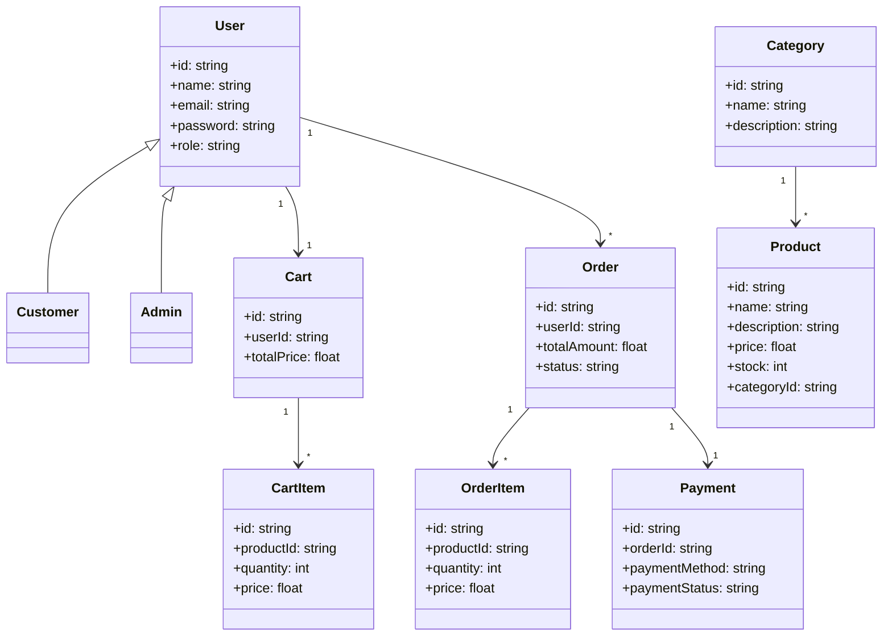

```mermaid
classDiagram

class User {
  +id: string
  +name: string
  +email: string
  +password: string
  +role: string
}

class Customer
class Admin

User <|-- Customer
User <|-- Admin

class Category {
  +id: string
  +name: string
  +description: string
}

class Product {
  +id: string
  +name: string
  +description: string
  +price: float
  +stock: int
  +categoryId: string
}

class Cart {
  +id: string
  +userId: string
  +totalPrice: float
}

class CartItem {
  +id: string
  +productId: string
  +quantity: int
  +price: float
}

class Order {
  +id: string
  +userId: string
  +totalAmount: float
  +status: string
}

class OrderItem {
  +id: string
  +productId: string
  +quantity: int
  +price: float
}

class Payment {
  +id: string
  +orderId: string
  +paymentMethod: string
  +paymentStatus: string
}

User "1" --> "1" Cart
User "1" --> "*" Order
Category "1" --> "*" Product
Cart "1" --> "*" CartItem
Order "1" --> "*" OrderItem
Order "1" --> "1" Payment
```