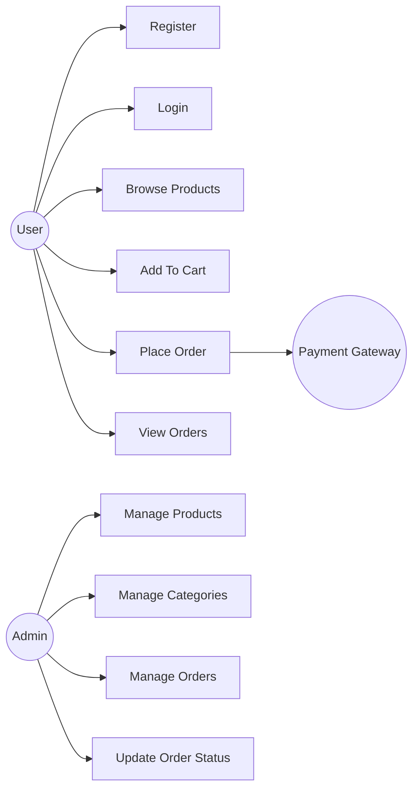

```mermaid
flowchart LR

User((User))
Admin((Admin))
PaymentGateway((Payment Gateway))

User --> Register
User --> Login
User --> BrowseProducts
User --> AddToCart
User --> PlaceOrder
User --> ViewOrders

Admin --> ManageProducts
Admin --> ManageCategories
Admin --> ManageOrders
Admin --> UpdateOrderStatus

PlaceOrder --> PaymentGateway

Register[Register]
Login[Login]
BrowseProducts[Browse Products]
AddToCart[Add To Cart]
PlaceOrder[Place Order]
ViewOrders[View Orders]

ManageProducts[Manage Products]
ManageCategories[Manage Categories]
ManageOrders[Manage Orders]
UpdateOrderStatus[Update Order Status]
```